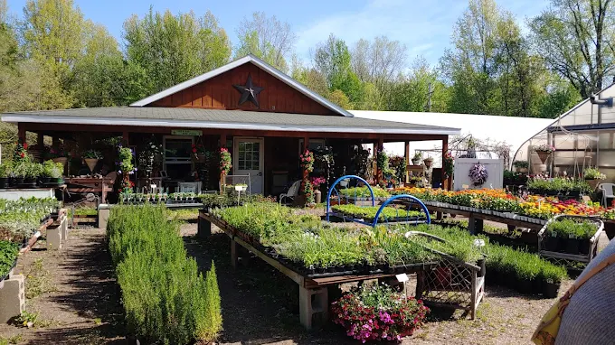

# Editing Guide

This is a static one-page website. Most changes happen inside `index.html`.

## Change the phone number

Search for:

```text
(810) 639-4750
```

Also search for:

```text
+18106394750
```

The second version is used for click-to-call links.

## Change the address

Search for:

```text
11440 Vienna Rd
```

Also update the Google Maps links if the address ever changes.

## Add business hours

Search for:

```text
Call for current hours
```

Replace that text with confirmed hours, such as:

```text
Mon–Sat: 9 AM–6 PM · Sun: 10 AM–4 PM
```

Only add hours after confirming them with the business.

## Replace a photo

Photos are stored in the `assets` folder.

Current photo filenames:

- `greenhouse-mums.webp`
- `inside-greenhouse-plants.webp`
- `hanging-baskets.webp`
- `garden-shop.webp`
- `strawberry-starts.webp`
- `montrose-sign.webp`
- `storefront.webp`
- `outdoor-plant-tables.webp`

To replace an image, either:

1. Keep the same filename and replace the file in `assets`, or
2. Add a new image to `assets` and update the image path in `index.html`.

Example image path:

```html

```

## Change colors

At the top of `index.html`, find the CSS variables under:

```css
:root {
```

The main colors are:

- `--forest`
- `--deep`
- `--leaf`
- `--sage`
- `--cream`
- `--sun`
- `--rose`

## Change section text

Search for the exact text you want to change inside `index.html`, edit it, save, and push the file back to GitHub.
